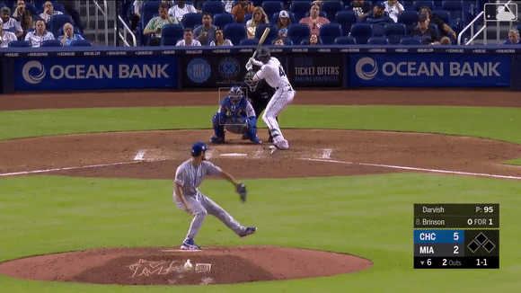

# tripleplay
A tool for comparing MLB pitchers using deep learning. Motivation is from baseballsavant.mlb.com where they do comparisons of hitters (not very good IMO) but not pitchers.

Workflow is very much like laser_show but instead will use convnets to process images. I didn't use convnets in laser_show because how the hit markers were large and overlapped 
one another thus leading to information loss in the convolutions. Latter I will demostrate how to use tractable unsupervised
learning ML algorithms, t-SNE in this case, to ascertain what the hidden layers maybe learning (discernible latent features in data). 
Then possibly using ensemble algos as well. 

# Motivation for using tSNE
AI (hate that term) is neither good nor evil. But they do reflect on our society. Including social bias, unfairness and discrimination. Mostly unintentional, either by laziness or carelessness. Sometimes with malicious intent, for example Palantir, the most perverse use of this technology.

I’m not going too much into the societal implications but will introduce some tools and strategies to weed out undesirable learning dynamics.
